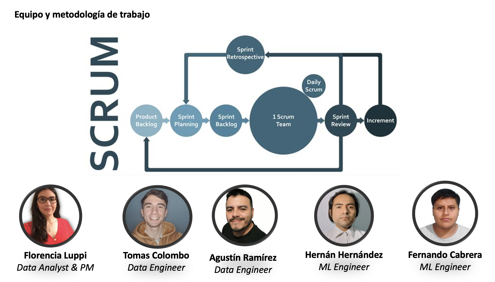
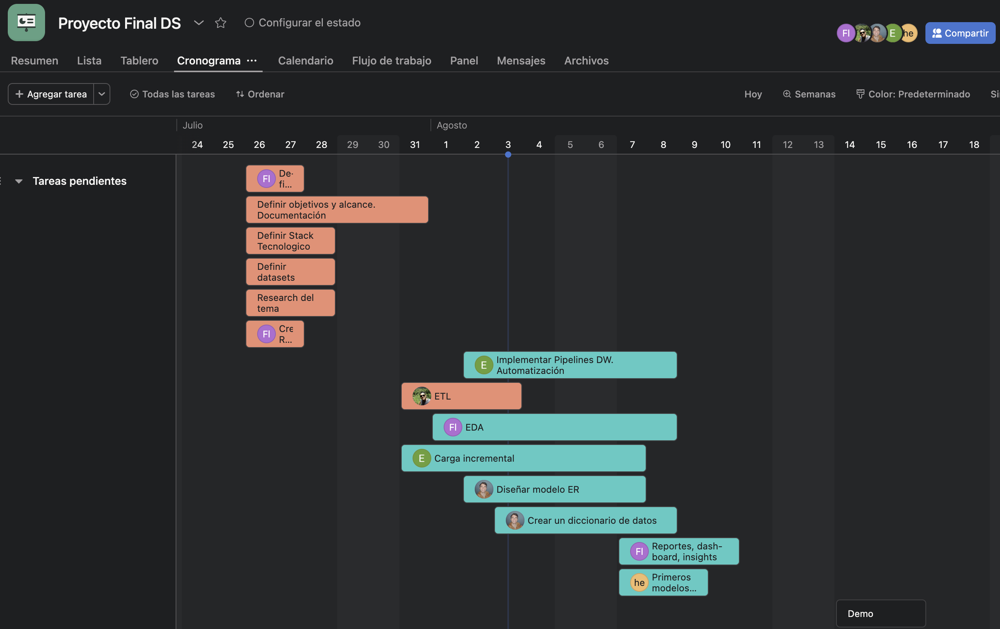

# Proyecto Restaurantes con Google Maps y Yelp

Bienvenidos a DataGrowth!

En DataGrowth, creemos en el poder transformador de la información. Somos una empresa dedicada a potenciar a otras empresas a tomar decisiones más informadas y estratégicas mediante el análisis y uso efectivo de datos. Nuestro objetivo es ayudar a las organizaciones a ser más competitivas en el mercado y expandir su potencial al máximo.

Somos apasionados por la data y su capacidad para impulsar el crecimiento empresarial. En un mundo impulsado por la información, consideramos que la data es una herramienta clave para obtener una ventaja competitiva, mejorar la eficiencia operativa y descubrir nuevas oportunidades de crecimiento.

Nuestro equipo de expertos en análisis de datos y consultoría está comprometido a brindar soluciones personalizadas a cada cliente. Trabajamos en estrecha colaboración con las empresas para entender sus necesidades únicas y ofrecer estrategias y soluciones adaptadas a sus objetivos específicos.

En esta ocasión queremos compartirles un proyecto especifico para el rubro de restaurantes.

## Equipo y metodologia de trabajo

## Objetivo 

El objetivo de este proyecto es proporcionar insights estratégicos del mercado de restaurantes en un área específica, mediante el análisis de datos obtenidos de diversas fuentes, como reseñas en Google Maps y Yelp, y datasets complementarios para entendimiento de mercado. En base a estos análisis, se buscará identificar oportunidades de crecimiento y mejoras para las empresas de restaurantes, brindando recomendaciones fundamentadas para optimizar su rendimiento y satisfacer las preferencias y necesidades de los clientes. 

El proyecto tiene como objetivo dar recomendaciones para nuevas aperturas y mejoras para la satisfacción del cliente y fidelización.

## Alcance

Se toman 6 Estados: Texas, California, Indiana, Kentucky, Iowa, Mississippi. La selección se hizo con un sistema de scoring ponderando variables de potencial y variables de costo.
El año a analizar es 2022.

Se excluye:
* Análisis detallado de competencia: El análisis se enfoca en el potencial y costos de apertura de nuevos restaurantes en los estados seleccionados, pero no incluye un análisis detallado de la competencia en cada mercado.

## KPIs

* Customer Satisfaction: 3/5 raiting (en 6 meses). 4/5 raiting (en 12 meses)
* Ocupación Promedio en nuevos restaurantes: 30% (en 6 meses)/ 50% (en 12 meses)
* Ticket promedio: USD$20 (+30%) en 12 meses.
* Customer Acquisition Cost: 30usd primeros 6 meses, 20usd después de los 6 meses.
* ROI ads: 100% en 6 meses, 300% en 12 meses.
* Desperdicio de alimentos: 10% en 12 meses.
* Huella de carbono: 20% de los insumos deberan adquirirse en no más de 200km (en 12 meses).

## Stack Tecnológico

* Github: Repositorio para hostear el trabajo colaborativo del proyecto.
* Asana: Organización de tareas, owners, y timelines.
* Visual Studio Code: Software para trabajar algunas transformaciones de datos y visualizaciones analiticas.
* Google Colab: Servicio cloud para trabajar de forma colaborativa en desarrollo de código para funciones.
* Google Cloud Platform: Plataforma de computación en la nube que ofrece una amplia gama de servicios de infraestructura y aplicaciones en la nube.
* Google Cloud Storage: Servicio Cloud de almacenamiento.
* Google Cloud Function: Servicio serverless para ejecutar código en respuesta a eventos y triggers.
* Google Cloud Scheduler: Servicio para programar eventos.
* Google Big Query: Servicio para crear tablas y hacer analisis de altos volumenes de datos.
* Google Maps API: Servicio de Google que permite integrar mapas y funciones geolocalizadas en aplicaciones, esencial para análisis geoespaciales en ciencia de datos.
* Power PowerBI: Software de visualización de datos.
* Python: Lenguaje de programación usado para ciencia de datos.

Librerias Python:
* Pandas
* Matplotlib
* Seaborn

## GANTT

